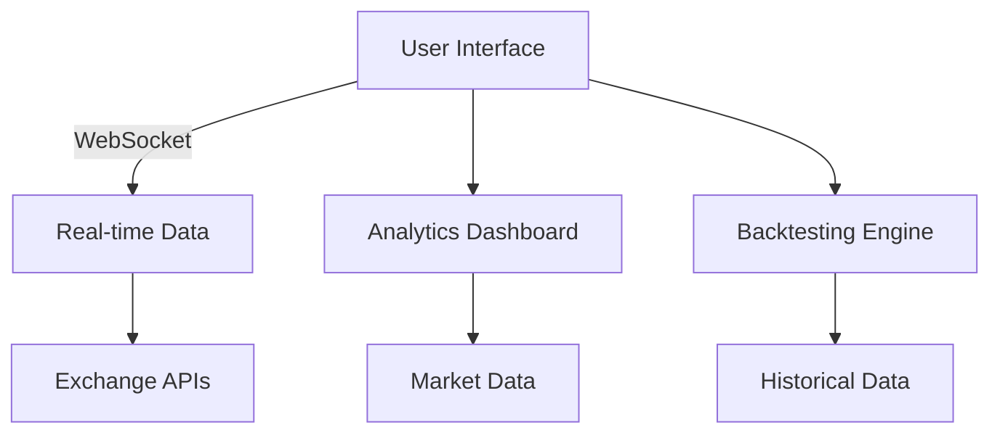
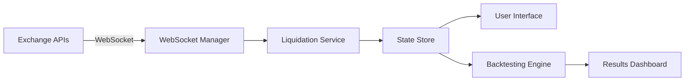
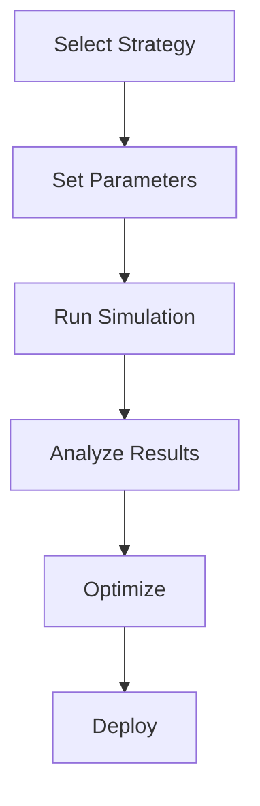
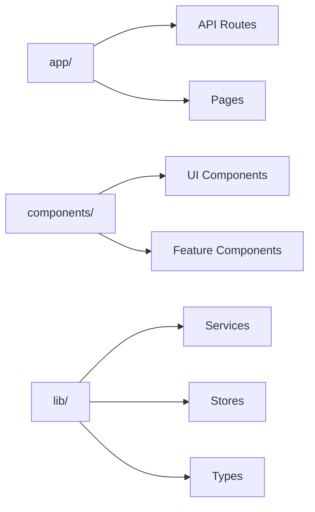
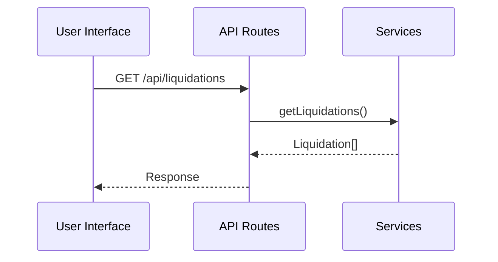

# 🚀 Liquidation Watch

<div align="center">
  

  
---


  **Real-Time Cryptocurrency Liquidation Tracker & Analytics Platform**
  
  [](https://nextjs.org/)
  [](https://www.typescriptlang.org/)
  [](https://tailwindcss.com/)
  [](https://opensource.org/licenses/MIT)
  
  [Live Demo](https://liquidation-watch.vercel.app/) • [Documentation](#documentation) • [Contributing](#contributing)
</div>

## 📋 Table of Contents

- [Overview](#overview)
- [Features](#features)
- [Technology Stack](#technology-stack)
- [Quick Start](#quick-start)
- [Installation](#installation)
- [Usage Guide](#usage-guide)
- [Project Structure](#project-structure)
- [API Documentation](#api-documentation)
- [Configuration](#configuration)
- [Deployment](#deployment)
- [Contributing](#contributing)
- [Educational Disclaimer](#educational-disclaimer)
- [License](#license)

## 🎯 Overview



Liquidation Watch is a comprehensive cryptocurrency liquidation tracking platform that provides real-time monitoring of liquidation events across major exchanges. Built with Next.js 14 and TypeScript, it offers traders and analysts powerful tools to understand market sentiment, track whale movements, and backtest liquidation-based trading strategies.

### Key Highlights

- **Real-Time Data**: Live liquidation feeds from Binance, Bybit, and OKX
- **Whale Monitoring**: Track large liquidations ($250K+) with retention history
- **Advanced Charts**: Multi-timeframe price analysis with volume data
- **Strategy Backtesting**: Test liquidation-based trading strategies
- **Market Analytics**: Comprehensive market overview and funding rates
- **Educational Focus**: Simulated data for learning and strategy development

## ✨ Features



### 🔴 Live Liquidations
- **Real-time liquidation feed** across major exchanges
- **Color-coded visualization** (Green for longs, Red for shorts)
- **Advanced filtering** by asset, exchange, and value
- **Search functionality** for specific symbols
- **Exchange logos** for quick identification

### 🐋 Whale Alerts
- **Large liquidation monitoring** ($250K+ threshold)
- **60-minute retention history** with fade effects
- **Glowing animations** for new whale liquidations
- **Scrollable interface** with proper overflow handling
- **Exchange-specific indicators**

### 📊 Price Charts
- **8 Major Trading Pairs**: BTC, ETH, SOL, ADA, DOT, AVAX, LINK, MATIC
- **3 Exchange Sources**: Binance, Bybit, OKX with color coding
- **6 Timeframes**: 1m, 5m, 15m, 1h, 4h, 1d
- **3 Chart Types**: Line chart, candlestick view, volume analysis
- **Real-time updates** every 30 seconds
- **Market statistics** with 24h change indicators

### 📈 Analytics Dashboard
- **Market overview** with total liquidations
- **Long vs Short ratios** and trends
- **Top liquidated assets** by volume
- **Exchange market share** analysis
- **Funding rates** across exchanges
- **Historical trend analysis**

### 🧪 Strategy Backtesting



- **3 Trading Strategies**:
  - Mean Reversion: Fade liquidation clusters
  - Liquidation Cascade: Trade with momentum
  - Trend Confirmation: Use liquidations to confirm trends
- **6 Market Scenarios**: Bull run, bear market, sideways, high volatility, crash, pump
- **Comprehensive Metrics**: Sharpe ratio, Sortino ratio, Calmar ratio, max drawdown
- **Real-time progress** with live updates
- **Detailed analysis** with equity curves and trade history

### 🎨 User Experience
- **Clean, modern interface** with dark/light theme support
- **Responsive design** for all screen sizes
- **Comprehensive user guide** with interactive modal
- **Professional branding** and consistent styling
- **Accessibility features** with proper ARIA labels

## 🛠 Technology Stack

### Frontend
- **[Next.js 14](https://nextjs.org/)** - React framework with App Router
- **[TypeScript](https://www.typescriptlang.org/)** - Type-safe JavaScript
- **[Tailwind CSS](https://tailwindcss.com/)** - Utility-first CSS framework
- **[shadcn/ui](https://ui.shadcn.com/)** - Modern React component library
- **[Recharts](https://recharts.org/)** - Composable charting library
- **[Lucide React](https://lucide.dev/)** - Beautiful icon library

### State Management & Data
- **[Zustand](https://github.com/pmndrs/zustand)** - Lightweight state management
- **[Luxon](https://moment.github.io/luxon/)** - Modern date/time library
- **WebSocket connections** for real-time data
- **Local storage** for user preferences

### Development Tools
- **[ESLint](https://eslint.org/)** - Code linting
- **[Prettier](https://prettier.io/)** - Code formatting
- **[PostCSS](https://postcss.org/)** - CSS processing
- **[Autoprefixer](https://autoprefixer.github.io/)** - CSS vendor prefixes

## 🚀 Quick Start

```bash
# Clone the repository
git clone https://github.com/liquidationwatch/liquidation-watch.git
cd liquidation-watch

# Install dependencies
npm install

# Start development server
npm run dev

# Open in browser
open http://localhost:3000
```

## 📦 Installation

### Prerequisites
- **Node.js** 18.0 or higher
- **npm** or **yarn** package manager
- **Git** for version control

### Step-by-Step Installation

1. **Clone the repository**
   ```bash
   git clone https://github.com/yllvar/liquidation-watch.git
   cd liquidation-watch
   ```

2. **Install dependencies**
   ```bash
   npm install
   # or
   yarn install
   ```

3. **Set up environment variables**
   ```bash
   cp .env.example .env.local
   ```
   
   Configure the following variables:
   ```env
   NEXT_PUBLIC_APP_URL=http://localhost:3000
   NEXT_PUBLIC_VERCEL_URL=your-vercel-url
   ```

4. **Start the development server**
   ```bash
   npm run dev
   ```

5. **Build for production**
   ```bash
   npm run build
   npm start
   ```

## 📖 Usage Guide

### Getting Started

1. **Open the application** in your browser
2. **Click "Get Started"** to open the comprehensive user guide
3. **Explore the tabs**:
   - **Liquidations**: Real-time liquidation feed and whale alerts
   - **Charts**: Price analysis with multiple timeframes
   - **Analytics**: Market overview and funding rates
   - **Backtesting**: Strategy testing and performance analysis

### Liquidations Tab

**Live Liquidation Feed**
- View real-time liquidations from major exchanges
- Use search bar to find specific assets
- Apply filters for exchange, value range, or asset type
- Monitor color-coded liquidations (green for longs, red for shorts)

**Whale Alerts Panel**
- Track large liquidations over $250K
- View 60-minute retention history
- Watch for glowing animations on new whale liquidations
- Scroll through historical whale events

### Charts Tab

**Trading Pair Selection**
- Choose from 8 major trading pairs
- Select exchange (Binance, Bybit, OKX)
- Pick timeframe (1m to 1d)
- Switch between chart types

**Market Analysis**
- Monitor current price and 24h changes
- Analyze daily high/low ranges
- Track trading volume patterns
- Correlate with liquidation events

### Analytics Tab

**Market Overview**
- Total liquidations across exchanges
- Long vs short liquidation ratios
- Top liquidated assets by volume
- Exchange market share analysis

**Funding Rates**
- Current funding rates across exchanges
- Historical funding rate trends
- Correlation with liquidation patterns

### Backtesting Tab

**Strategy Configuration**
- Select trading strategy (Mean Reversion, Liquidation Cascade, Trend Confirmation)
- Choose market scenario (Bull Run, Bear Market, etc.)
- Set initial capital and position sizing
- Configure stop loss and take profit levels

**Performance Analysis**
- Monitor real-time backtesting progress
- Analyze comprehensive performance metrics
- Review equity curves and trade history
- Export results for further analysis

## 📁 Project Structure



```
liquidation-watch/
├── app/                          # Next.js App Router
│   ├── api/                      # API routes
│   │   ├── liquidations/         # Liquidation data endpoints
│   │   ├── funding-rates/        # Funding rate endpoints
│   │   └── market-info/          # Market data endpoints
│   ├── globals.css               # Global styles
│   ├── layout.tsx                # Root layout component
│   └── page.tsx                  # Home page
├── components/                   # React components
│   ├── ui/                       # shadcn/ui components
│   │   ├── button.tsx
│   │   ├── card.tsx
│   │   ├── dialog.tsx
│   │   └── ...
│   ├── analytics-view.tsx        # Analytics dashboard
│   ├── backtesting-dashboard.tsx # Backtesting interface
│   ├── chart-panel.tsx           # Price charts
│   ├── header.tsx                # Navigation header
│   ├── liquidation-table.tsx     # Main liquidation feed
│   ├── user-guide-modal.tsx      # User guide popup
│   └── whale-alert-table.tsx     # Whale alerts panel
├── lib/                          # Utility libraries
│   ├── services/                 # Business logic services
│   │   ├── backtesting-engine.ts # Strategy backtesting
│   │   ├── data-simulation.ts    # Market data simulation
│   │   ├── liquidation-service.ts # Liquidation data handling
│   │   └── websocket-manager.ts  # Real-time connections
│   ├── stores/                   # State management
│   │   └── liquidation-store.ts  # Liquidation state
│   ├── types/                    # TypeScript definitions
│   │   └── liquidation.ts        # Data type definitions
│   └── utils.ts                  # Utility functions
├── public/                       # Static assets
│   ├── favicon.ico
│   ├── bnb.svg                   # Exchange logos
│   ├── bybit.svg
│   └── okx.svg
├── next.config.js                # Next.js configuration
├── tailwind.config.js            # Tailwind CSS configuration
├── tsconfig.json                 # TypeScript configuration
└── package.json                  # Dependencies and scripts
```

## 🔌 API Documentation



### Liquidations API

**GET /api/liquidations**
```typescript
// Query parameters
interface LiquidationQuery {
  exchange?: 'BINANCE' | 'BYBIT' | 'OKX'
  symbol?: string
  limit?: number
}

// Response
interface LiquidationResponse {
  liquidations: Liquidation[]
  timestamp: string
  total: number
}
```

**GET /api/liquidations/stream**
- WebSocket endpoint for real-time liquidation data
- Supports exchange filtering and symbol subscriptions

### Market Data API

**GET /api/market-info**
```typescript
// Response
interface MarketInfoResponse {
  totalOI: number
  dailyVolume: number
  fearGreedIndex: number
  dominanceData: DominanceData[]
  timestamp: string
}
```

**GET /api/funding-rates**
```typescript
// Response
interface FundingRateResponse {
  fundingRates: FundingRate[]
  exchanges: string[]
  totalRates: number
  timestamp: string
}
```

## ⚙️ Configuration

### Environment Variables

```env
# Application URLs
NEXT_PUBLIC_APP_URL=http://localhost:3000
NEXT_PUBLIC_VERCEL_URL=your-vercel-url

# API Configuration
NEXT_PUBLIC_WS_URL=wss://your-websocket-url
NEXT_PUBLIC_API_BASE_URL=https://your-api-url

# Analytics (Optional)
NEXT_PUBLIC_GA_ID=your-google-analytics-id
VERCEL_ANALYTICS_ID=your-vercel-analytics-id
```

### Customization Options

**Theme Configuration** (`tailwind.config.js`)
```javascript
module.exports = {
  theme: {
    extend: {
      colors: {
        primary: "hsl(var(--primary))",
        secondary: "hsl(var(--secondary))",
        // Custom color scheme
      }
    }
  }
}
```

**Data Simulation Settings** (`lib/services/data-simulation.ts`)
```typescript
// Adjust market scenarios
const MARKET_SCENARIOS = [
  {
    id: "custom_scenario",
    name: "Custom Scenario",
    volatility: 0.03,
    trendBias: 0.001,
    liquidationMultiplier: 1.2
  }
]
```

## 🚀 Deployment

### Vercel (Recommended)

1. **Connect your repository** to Vercel
2. **Configure environment variables** in Vercel dashboard
3. **Deploy automatically** on every push to main branch

```bash
# Install Vercel CLI
npm i -g vercel

# Deploy to Vercel
vercel --prod
```

### Docker Deployment

```dockerfile
# Dockerfile
FROM node:18-alpine AS deps
WORKDIR /app
COPY package*.json ./
RUN npm ci --only=production

FROM node:18-alpine AS builder
WORKDIR /app
COPY . .
COPY --from=deps /app/node_modules ./node_modules
RUN npm run build

FROM node:18-alpine AS runner
WORKDIR /app
ENV NODE_ENV production
COPY --from=builder /app/public ./public
COPY --from=builder /app/.next/standalone ./
COPY --from=builder /app/.next/static ./.next/static

EXPOSE 3000
ENV PORT 3000

CMD ["node", "server.js"]
```

### Manual Deployment

```bash
# Build the application
npm run build

# Start production server
npm start

# Or use PM2 for process management
npm install -g pm2
pm2 start npm --name "liquidation-watch" -- start
```

## 🤝 Contributing

We welcome contributions from the community! Please follow these guidelines:

### Development Workflow

1. **Fork the repository**
2. **Create a feature branch**
   ```bash
   git checkout -b feature/amazing-feature
   ```
3. **Make your changes**
4. **Run tests and linting**
   ```bash
   npm run lint
   npm run type-check
   ```
5. **Commit your changes**
   ```bash
   git commit -m 'Add amazing feature'
   ```
6. **Push to your branch**
   ```bash
   git push origin feature/amazing-feature
   ```
7. **Open a Pull Request**

### Code Standards

- **TypeScript**: Use strict typing and proper interfaces
- **ESLint**: Follow the configured linting rules
- **Prettier**: Format code consistently
- **Conventional Commits**: Use semantic commit messages
- **Component Structure**: Follow the established patterns

### Areas for Contribution

- **New Trading Strategies**: Implement additional backtesting strategies
- **Exchange Integration**: Add support for more exchanges
- **Chart Indicators**: Add technical analysis indicators
- **Performance Optimization**: Improve rendering and data handling
- **Documentation**: Enhance guides and API documentation
- **Testing**: Add unit and integration tests
- **Accessibility**: Improve screen reader support

## ⚠️ Educational Disclaimer

**IMPORTANT: This platform is designed for educational purposes only.**

### Key Points

- **Simulated Data**: All liquidation data and market information is simulated for demonstration and learning purposes
- **Not Financial Advice**: This platform does not provide financial advice or investment recommendations
- **Risk Warning**: Cryptocurrency trading involves significant risk of loss
- **Educational Focus**: Use this platform to learn about liquidation patterns and trading concepts
- **No Guarantees**: Past performance does not guarantee future results

### Recommended Usage

- **Learning Tool**: Understand how liquidations affect market dynamics
- **Strategy Development**: Test and refine trading strategies in a risk-free environment
- **Market Analysis**: Study correlation between liquidations and price movements
- **Educational Research**: Explore cryptocurrency market mechanics

### Before Live Trading

- **Conduct thorough research** on real market conditions
- **Consult financial advisors** for investment decisions
- **Start with small amounts** you can afford to lose
- **Use proper risk management** techniques
- **Understand the risks** involved in cryptocurrency trading

## 📄 License

This project is licensed under the MIT License - see the [LICENSE](LICENSE) file for details.

```
MIT License

Copyright (c) 2025 Liquidation Watch Team

Permission is hereby granted, free of charge, to any person obtaining a copy
of this software and associated documentation files (the "Software"), to deal
in the Software without restriction, including without limitation the rights
to use, copy, modify, merge, publish, distribute, sublicense, and/or sell
copies of the Software, and to permit persons to whom the Software is
furnished to do so, subject to the following conditions:

The above copyright notice and this permission notice shall be included in all
copies or substantial portions of the Software.

THE SOFTWARE IS PROVIDED "AS IS", WITHOUT WARRANTY OF ANY KIND, EXPRESS OR
IMPLIED, INCLUDING BUT NOT LIMITED TO THE WARRANTIES OF MERCHANTABILITY,
FITNESS FOR A PARTICULAR PURPOSE AND NONINFRINGEMENT. IN NO EVENT SHALL THE
AUTHORS OR COPYRIGHT HOLDERS BE LIABLE FOR ANY CLAIM, DAMAGES OR OTHER
LIABILITY, WHETHER IN AN ACTION OF CONTRACT, TORT OR OTHERWISE, ARISING FROM,
OUT OF OR IN CONNECTION WITH THE SOFTWARE OR THE USE OR OTHER DEALINGS IN THE
SOFTWARE.
```

---

<div align="center">
  <p>Built with ❤️ by the Liquidation Watch Team</p>
  <p>
    <a href="https://github.com/liquidationwatch/liquidation-watch">⭐ Star us on GitHub</a> •
    <a href="https://twitter.com/liquidationwatch">🐦 Follow on Twitter</a> •
    <a href="https://liquidationwatch.com">🌐 Visit Website</a>
  </p>
</div>
```


